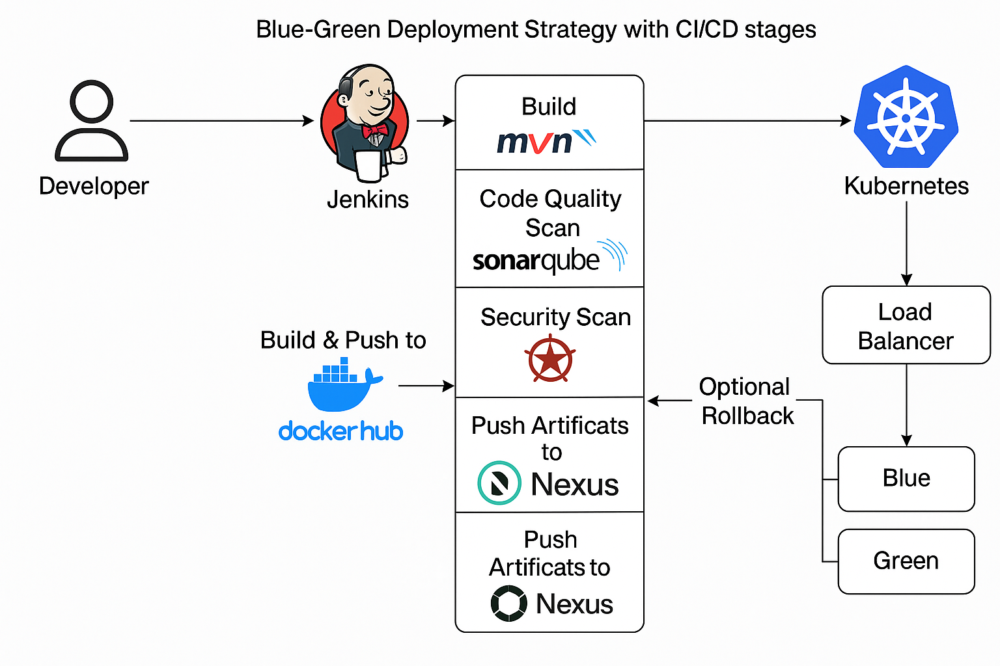

# 🚀 Blue-Green Deployment Strategy with Kubernetes

This project demonstrates a **Blue-Green Deployment** strategy on Kubernetes with complete DevOps automation using Jenkins, SonarQube, Nexus, Docker, and more.

---




--- 

## 📁 Clone the Repository

```bash
git clone https://github.com/<your-username>/Blue-Green-Deployment-Strategy-with-Kubernetes.git
cd Blue-Green-Deployment-Strategy-with-Kubernetes/cluster
```

---

## ⚙️ Configure Terraform
### Edit the terraform.tfvars file with your appropriate values:
```bash
vpc_cidr_block    = ""
subnet_cidr_block = ""
azs               = ""
key               = ""
```

---

## 🌐 Initialize & Apply Terraform

```bash
terraform init
terraform plan
terraform apply
```

---

## ☸️ Install kubectl

### Follow the instructions to install kubectl:

[➡️ Install kubectl](https://github.com/p-k-pavan/Devops-Tools-Installation/tree/main/kubectl)

---

## 🔐 Setup RBAC

### Refer to the RBAC configuration:

[📄 Setup-RBAC.md](https://github.com/p-k-pavan/Blue-Green-Deployment-Strategy-with-Kubernetes/blob/main/Cluster/eks-rbac.md)

---

## 🖥️ Setup Required Servers

### Provision 3 separate servers for the following:

- Jenkins
- SonarQube
- 

---
## 🔍 SonarQube Setup

### On the SonarQube server:

```bash
sudo apt update
sudo apt install docker.io -y
sudo usermod -aG docker $USER && newgrp docker
```

### Run SonarQube using Docker:

[🔗 SonarQube Setup Guide](https://github.com/p-k-pavan/Devops-Tools-Installation/tree/main/SonarQube)

---
## 📦 Nexus Setup
### On the Nexus server:

```bash
sudo apt update
sudo apt install docker.io -y
sudo usermod -aG docker $USER && newgrp docker
```

### Run Nexus using Docker:

[🔗 Nexus Setup Guide](https://github.com/p-k-pavan/Devops-Tools-Installation/tree/main/Nexus)

### To get the Nexus admin password:

```bash
docker exec -it nexus bash
cat nexus-data/admin.password
```

---

## 🛠 Jenkins Setup

### On the Jenkins server:

### Install Java 21:

- [🔗 Java 21 Installation](https://github.com/p-k-pavan/Devops-Tools-Installation/tree/main/JAVA21)

### Install Jenkins:

- [🔗 Jenkins Installation](https://github.com/p-k-pavan/Devops-Tools-Installation/tree/main/Jenkins)

### Access Jenkins at:

```bash
🌐 http://<your-server-ip>:8080
```

---

## 🔐 Security & DevOps Tools

### ✅ Install Trivy

[🔗 Trivy Installation](https://github.com/p-k-pavan/Devops-Tools-Installation/tree/main/Trivy)

---

## 🐳 Install Docker on Jenkins Server

```bash
sudo usermod -aG docker $USER && newgrp docker
sudo usermod -aG docker jenkins && newgrp docker
sudo systemctl restart jenkins
```

---

## 🔧 Jenkins Configuration

### 📦 Plugins to Install

- Pipeline Stage View
- Docker Pipeline
- SonarQube Scanner
- Quality Gates
- Maven Integration
- JDK Installer
- Eclipse Integration
- Kubernetes
- Kubernetes CLI & API
- Kubernetes Credentials
- File Config Plugin

---

## 🔐 Credentials to Add

- GitHub credentials
- SonarQube token
- DockerHub credentials
- EKS or kubeconfig token
- Nexus credentials (optional)

---

## 🧰 Tools to Add

- JDK (Java 17 or Java 21)
- Maven (latest version)
- SonarQube

---

## ⚙️ System Configuration

- Add SonarQube server URL and authentication token in Jenkins under System Configuration

---

## 🧩 Jenkins File & Nexus Configuration
### 📥 Jenkins Maven File Configuration

- Open File Config Plugin in Jenkins
-  Add a Maven integration
- On line ~120: Uncomment Maven-related configs
- Add snapshot and release in jenkins config file

### Update Nexus URLs in GITHUB:

- pom.xml (on Jenkins)

---

## ✅ Final Step: Trigger the Jenkins Pipeline

### Run your Jenkins pipeline to execute full Blue-Green Deployment with CI/CD:

- ✅ Build

- ✅ Quality Scan with SonarQube

- ✅ Security Scan with Trivy

- ✅ Push artifacts to Nexus

- ✅ Deploy to Kubernetes (Blue/Green Deployment)

---

## 📌 Notes

- Ensure Jenkins has access to the Kubernetes cluster using kubeconfig or EKS credentials.

- All tools must be correctly configured with tokens, URLs, and user credentials.

- You can optionally integrate GitOps for more advanced delivery workflows.